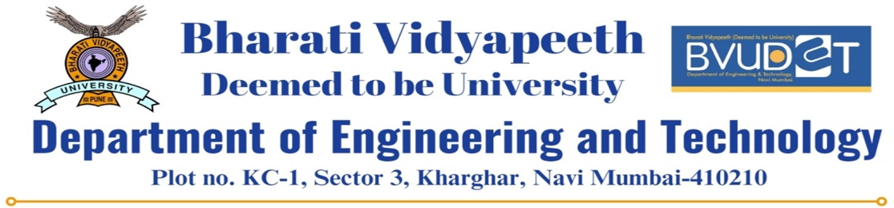

```{r setup, include=FALSE}
knitr::opts_chunk$set(echo = TRUE)
```

#### **Subject**: Computing Lab - III | Experiment No - 01 (3rd YEAR CSE-AIML 2023-2024)

|                    |                                  |
|--------------------|----------------------------------|
|     Roll No: 11    |         Name: Kamran Khan        |
|   Class: CSE-AIML  |             Batch: B1            |
|   PRN: 2143110133  | Date of Experiment:  05 / 01 / 2024 |
| Marks (Out of 25): |  Date of Submission: __ / 01/ 2024 |


#### **Aim:** 
To understand and implement basic concepts of R programming including variable assignments, data types, vectors, arithmetic and logical operations, control flow, and data frames.

#### **Theory:**
R is a programming language and free software environment for statistical computing and graphics. It is widely used among statisticians and data miners for developing statistical software and data analysis.


```{r}
# Assign Value to Variable
x <- 5
y <- "Kamran Khan"

# Datatypes
datatype_x <- class(x)
datatype_y <- class(y)

print(paste("Datatype of x:", datatype_x))
print(paste("Datatype of y:", datatype_y))
```

```{r}
# Vectors
numeric_vec <- c(1, 2, 3, 4)
char_vec <- c("Kamran Khan", "CSE-AIML", "ROll No 11")

print(numeric_vec)
print(char_vec)
```

```{r}
# Arithmetic Operation
result <- x + 14

print(paste("Result of arithmetic operation:", result))
```

```{r}
# logical Operation
is_greater <- x > 3
print(paste("Is x greater than 3:", is_greater))
```

```{r}
# Control Flow Statements
if(x > 0){
  positive_message <- paste("x is a positive number")
}else{
  positive_message <- paste("x is a negative number")
}

print(positive_message)
```

```{r}
# Dataframe
dataframe <- data.frame(
  Name = c("Kamran", "Shubham", "Sarthak"),
  Age = c(19, 20, 20),
  Branch = c("CSE-AIML", "CSE-AIML", "CSE-AIML")
)
print(dataframe)
```

```{r}
print(LETTERS)
print(letters)
```


#### **Conclusion**: 
This experiment introduced the fundamental concepts of R programming. Understanding these basics, such as variable assignment, data types, vectors, arithmetic and logical operations, control flow, and data frames, is crucial for anyone beginning their journey in R programming and data analysis.